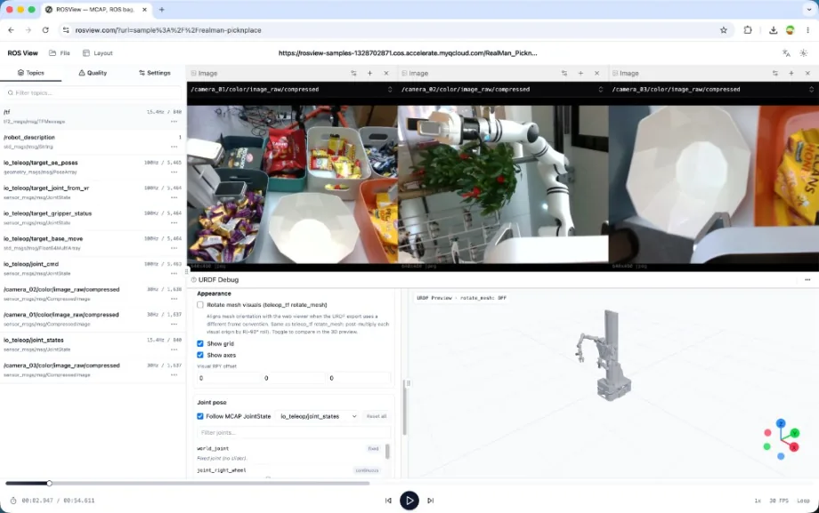

# ROSView &nbsp;·&nbsp; [Live Demo →](https://rosview.com) 

[简体中文文档 - README.zh.md](README.zh.md)

[](https://github.com/ioai-tech/rosview/actions/workflows/ci.yml)
[](https://www.npmjs.com/package/@ioai/rosview)
[](LICENSE)

> High-performance, browser-native robotics data visualization. Built from scratch on React 19, Vite 8, and Web Workers.

Supports **MCAP**, **ROS 1 bag**, **ROS 2 db3**, **HDF5**, and **BVH** files. Available as a standalone SPA (zero-install, runs at [rosview.com](https://rosview.com)) or as an embeddable npm package.

<p align="center">
  <a href="https://rosview.com">
    
  </a>
</p>

---

## Documentation

| Document | Description |
|----------|-------------|
| [Embedding guide](docs/EMBEDDING.md) | Integrate `@ioai/rosview` into a React app (bundler, manifest, troubleshooting). Chinese: [EMBEDDING.zh.md](docs/EMBEDDING.zh.md). |
| [API reference](docs/API.md) | Public exports: `RosViewer` props, types, preferences, layout helpers, extensions. Chinese: [API.zh.md](docs/API.zh.md). |
| [Architecture](docs/ARCHITECTURE.md) | Requirements, design, and technical notes (SPA + npm). Chinese: [ARCHITECTURE.zh.md](docs/ARCHITECTURE.zh.md). |
| [Development](docs/DEVELOPMENT.md) | Local setup, tests, Playwright, fixtures. |
| [Release](docs/RELEASE.md) | Maintainer workflow: versioning, tags, npm & GitHub Releases. |
| [Contributing](CONTRIBUTING.md) | Branch workflow, commits, PR checklist. |
| [Security](SECURITY.md) | Supported versions and responsible disclosure. |
| [Docs index](docs/README.md) | Full map of all documentation files. |

**Simplified Chinese:** [README](README.zh.md) · [Embedding](docs/EMBEDDING.zh.md) · [API](docs/API.zh.md) · [Architecture](docs/ARCHITECTURE.zh.md)

---

## Features

- **Multi-format** — MCAP · ROS 1 `.bag` · ROS 2 `.db3` · HDF5 `.h5/.hdf5` · BVH skeletal animation
- **Zero-copy parsing** — dedicated Web Workers + Comlink; main thread is never blocked
- **HTTP Range streaming** — load remote files without downloading them in full
- **Multi-panel layout** — draggable, dockable panels powered by DockView
- **Visualization panels** — Image (H.264), 3D (point clouds, URDF, TF), Plot (uPlot), Joints, Map, Audio, RawMessages, TopicGraph, Pose
- **Internationalization** — English · Simplified Chinese · Japanese
- **Dark / light / system** theme
- **Extension API** — register third-party sidebar tabs and playback-track overlay regions

---

## Quick Start (SPA)

Open **[rosview.com](https://rosview.com)** in Chrome or Edge — no installation required.

You can deep-link directly to a file via URL parameters:

```
https://rosview.com?url=https://your-server.com/recording.mcap
https://rosview.com?url=/examples/run.mcap
https://rosview.com?url=file://run.mcap
https://rosview.com?url=folder://MyDataset
https://rosview.com?url=sample://franka_stack
https://rosview.com?url=https://your-server.com/recording.mcap&theme=dark&language=zh
```

Remote manifests and multiple URLs are supported via the `fileManifest` / `urls` props when embedding the npm package.

### Self-host

```bash
git clone https://github.com/ioai-tech/rosview.git
cd rosview
npm install
npm run dev          # development server at http://localhost:5173
npm run build        # production SPA → dist/
```

---

## Embedding (npm package)

### Installation

```bash
npm install @ioai/rosview
```

> **Peer dependencies**: React ≥ 19, react-dom ≥ 19, three, @react-three/fiber, and @react-three/drei must already be installed in your project.

### Import the stylesheet

```tsx
import '@ioai/rosview/style.css';
```

### Basic usage

```tsx
import { RosViewer } from '@ioai/rosview';

export function MyApp() {
  return (
    <RosViewer
      url="https://your-server.com/recording.mcap"
      theme="dark"
      language="en"
    />
  );
}
```

### Load local files

```tsx
import { RosViewer } from '@ioai/rosview';

export function FileLoader() {
  const [file, setFile] = React.useState<File>();

  return (
    <>
      <input type="file" accept=".mcap,.bag,.db3,.h5,.hdf5,.bvh"
        onChange={e => setFile(e.target.files?.[0])} />
      {file && <RosViewer file={file} theme="system" />}
    </>
  );
}
```

### Multiple sources + remote manifest

```tsx
<RosViewer
  urls={['https://cdn.example.com/run1.mcap', 'https://cdn.example.com/run2.mcap']}
  fileManifest="https://cdn.example.com/manifest.json"
  theme="dark"
  language="zh"
  onFatalError={(err) => console.error('Fatal:', err)}
/>
```

**`manifest.json`** format:

```json
[
  { "url": "https://cdn.example.com/run1.mcap", "name": "Run 1", "sizeBytes": 1073741824 },
  { "url": "https://cdn.example.com/run2.mcap", "name": "Run 2", "durationSec": 120 }
]
```

---

## Supported File Formats

| Format | Extension | Notes |
|--------|-----------|-------|
| MCAP | `.mcap` | ROS 2 / robotics standard; zstd and lz4 compression |
| ROS 1 bag | `.bag` | ROS 1 recording format |
| ROS 2 SQLite | `.db3` | ROS 2 default recording (via `sql.js` WASM) |
| HDF5 | `.h5`, `.hdf5` | Scientific data; partial read via `@ioai/hdf5` |
| BVH | `.bvh` | Skeletal motion capture animation |

All formats are parsed entirely in the browser via Web Workers — no server-side processing required.

---

## Keyboard Shortcuts

| Key | Action |
|-----|--------|
| `Space` | Play / Pause |
| `←` / `→` | Step backward / forward one frame |
| `[` / `]` | Decrease / increase playback speed |
| `Home` | Jump to start |
| `End` | Jump to end |

---

## URL Parameters (SPA)

| Parameter | Example | Description |
|-----------|---------|-------------|
| `url` | `?url=https://…/file.mcap` or `?url=/examples/run.mcap` | Single remote file; updated on load/switch via `pushState` |
| `url` | `?url=file://name.mcap` | Local file locator (replay from Recent / IndexedDB handles) |
| `url` | `?url=folder://MyDataset` | Local folder locator (replay from Recent directory handle) |
| `url` | `?url=sample://franka_stack` | Sample id from the build-time manifest (`VITE_SAMPLE_DATASETS_MANIFEST_URL` / `VITE_SAMPLES_BASE_URL`) |
| `theme` | `?theme=dark` | `light` · `dark` · `system` |
| `language` | `?language=zh` | `en` · `zh` · `ja` |

Multiple remote URLs or a remote manifest JSON URL are supported via the `urls` / `fileManifest` **props** when embedding the library, not via extra query keys in the standalone SPA.

---

## API Reference

See [docs/API.md](docs/API.md) for the complete component props, TypeScript types, utility functions, and advanced embedding patterns. Chinese: [docs/API.zh.md](docs/API.zh.md).

---

## Contributing

We welcome issues and pull requests! Please read [CONTRIBUTING.md](CONTRIBUTING.md) before submitting.

- **Bug reports** — use the [Bug Report](.github/ISSUE_TEMPLATE/bug_report.yml) template
- **Feature requests** — use the [Feature Request](.github/ISSUE_TEMPLATE/feature_request.yml) template
- **Security vulnerabilities** — see [SECURITY.md](SECURITY.md)

---

## License

[MIT](LICENSE) © 2026 [IO-AI Tech](https://rosview.com)
