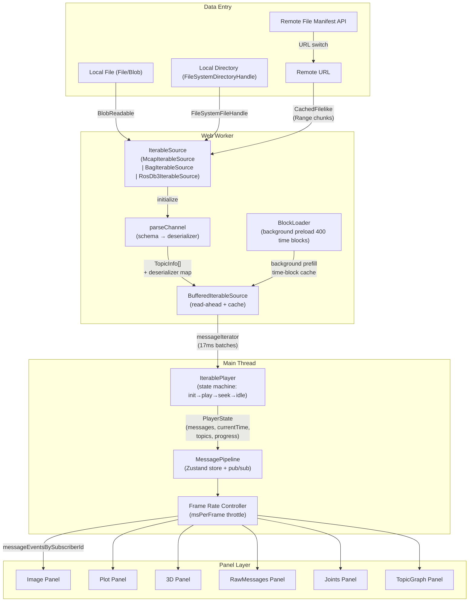
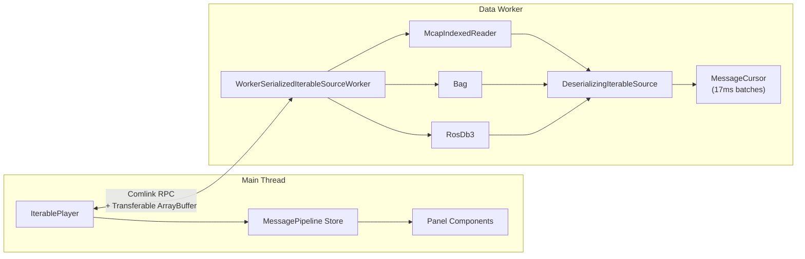
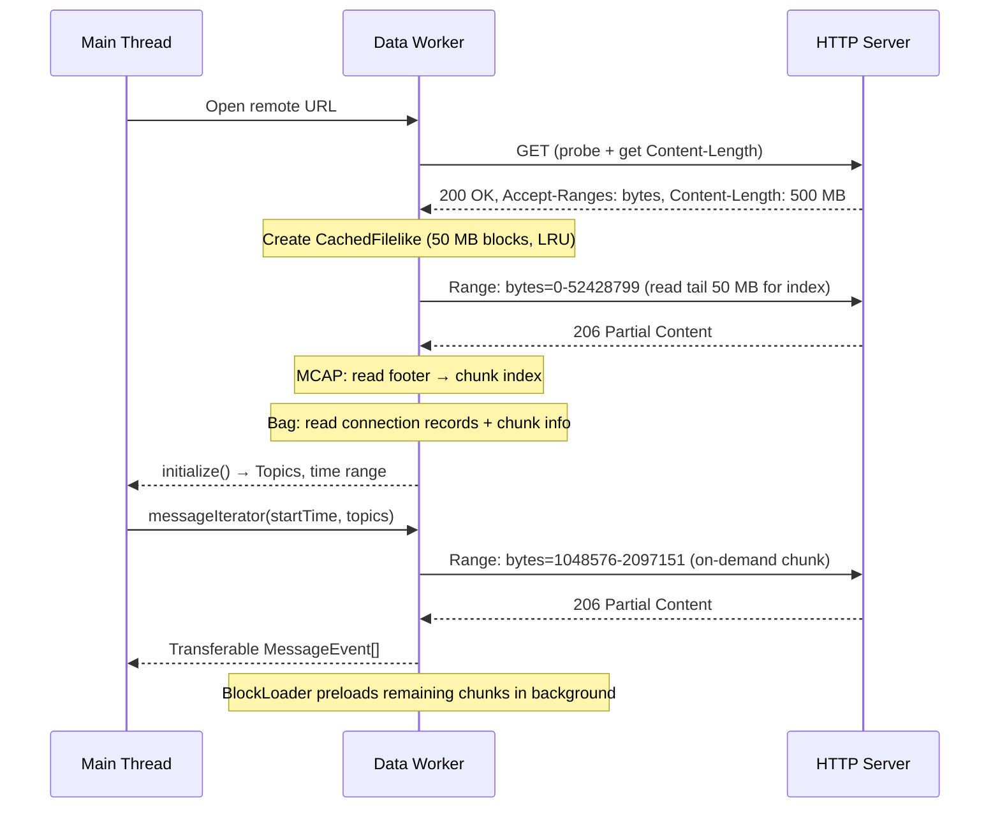

# ROS View — Architecture & Design

> Also available in Chinese: [ARCHITECTURE.zh.md](ARCHITECTURE.zh.md)

This document describes the requirements, architecture, and technical design of **ROS View** — a high-performance, browser-based ROS data visualization application. It covers both the standalone SPA and the embeddable React component delivery forms.

---

## 1. Project Overview

### 1.1 Positioning

ROS View is a **browser-native** playback and visualization tool for robotics recording files. It runs entirely client-side — no server-side processing required — and supports:

| Format | Description |
|--------|-------------|
| **MCAP** | Preferred format. Chunk-indexed for efficient range queries. |
| **ROS1 `.bag`** | Chunk-indexed binary log format. |
| **ROS2 `.db3`** | SQLite-based format via `@foxglove/sql.js` WASM. |
| **HDF5** | via `@ioai/hdf5` WASM. |
| **BVH** | Motion-capture skeleton animation. |

### 1.2 Two Delivery Forms

| Form | Description |
|------|-------------|
| **Standalone SPA** | Built as a pure static site (no server required). Deploy to any CDN or static host. Live demo: [rosview.com](https://rosview.com) |
| **Embeddable component** | Published to npm as `@ioai/rosview`. Consumed as a React component in any web application. |

### 1.3 Performance Targets

- First frame visible for a 1 GB MCAP file in **< 2 seconds** (local)
- Remote files start playing immediately via HTTP Range requests — no full download required
- Main-thread frame rate held at **60 fps** without UI jank from data parsing
- Controlled memory usage via LRU cache + streaming reads

---

## 2. Core Feature Requirements

### 2.1 Data Sources

| Type | Entry Point | Implementation |
|------|-------------|----------------|
| **Local single file** | Drag-and-drop / "Open File" button | `File` API → `BlobReadable` |
| **Local directory** | "Open Directory" / folder drag | `FileSystemDirectoryHandle` → scan `.mcap/.bag/.db3` |
| **Remote single file** | URL input / `?url=` query param | `fetch` + Range → `CachedFilelike` chunked cache |
| **Remote file manifest** | `fileManifest` prop (embedded app) | Load JSON list, switch in Datasets tab |

### 2.2 File Formats and Message Encodings

**Supported file formats:**

| Format | Library | Range Support | Notes |
|--------|---------|---------------|-------|
| **MCAP** | `@mcap/core` + `@foxglove/mcap-support` | Full (chunk index) | Preferred; efficient interval queries |
| **ROS1 `.bag`** | `@foxglove/rosbag` | Full (chunk index) | via `CachedFilelike` + `BrowserHttpReader` |
| **ROS2 `.db3`** | `@foxglove/rosbag2-web` + `@foxglove/sql.js` (WASM) | Local / remote requires full download | SQLite limitation; convert to MCAP for large remote files |

**Supported message encodings:**

| Encoding | Schema Type | Parsing |
|----------|-------------|---------|
| `ros1` | `ros1msg` | `@foxglove/rosmsg-serialization` → `MessageReader` |
| `cdr` (ROS2) | `ros2msg` / `ros2idl` / `omgidl` | `@foxglove/rosmsg2-serialization` / `OmgidlMessageReader` |
| `protobuf` | `protobuf` | `protobufjs` → `Root.decode` |
| `flatbuffer` | `flatbuffer` | FlatBuffers schema parsing |
| `json` | `jsonschema` or none | `TextDecoder` + `JSON.parse` |

### 2.3 Panel System (Initial 6 Types)

| Panel | Description | Typical Topics |
|-------|-------------|----------------|
| **Image** | Camera image stream (JPEG/PNG/H264 decode) | `sensor_msgs/Image`, `sensor_msgs/CompressedImage` |
| **Plot** | Numeric time-series chart, multiple topics overlay | Any message with numeric fields |
| **3D** | Point cloud, URDF model, TF transform visualization | `sensor_msgs/PointCloud2`, `tf2_msgs/TFMessage`, URDF |
| **RawMessages** | Raw message JSON tree viewer | Any topic |
| **Joints** | Robot joint state visualization (angle/torque gauges) | `sensor_msgs/JointState` |
| **TopicGraph** | Topology graph of topics and nodes | Metadata (topic list + publisher/subscriber relationships) |

Panel system requirements:
- Each panel type is loaded via `React.lazy` — unused panel code is never included in the initial bundle
- Panels declare subscriptions via `panelId` to the `MessagePipeline` and only receive topics they care about
- The Settings Sidebar provides per-panel configuration (topic selection, color mapping, etc.)
- A `registerPanel` API is reserved for future third-party panel extensions

### 2.4 Playback System

| Capability | Description |
|------------|-------------|
| **Play/Pause** | Push messages in timestamp order |
| **Speed control** | 0.1× / 0.25× / 0.5× / 1× / 2× / 4× / 8× / Max |
| **Seek** | Click anywhere on the timeline; backfills the nearest message for each subscribed topic |
| **Loop** | Automatically restart from the beginning on end-of-file |
| **Step** | Forward/backward by one message or a fixed time step |
| **Progress indicator** | Shows buffered time range (useful for remote files with partial loading) |

### 2.5 Sidebar

Fixed-width sidebar (collapsible) on the left with three tabs:

#### Topics Tab
- Tree view of all ROS topics in the current file
- Per-topic: name, message type, message frequency, message count
- Click to quickly add the relevant panel to the DockView layout
- Supports search/filter

#### Datasets (Data) Tab
- **Local directory mode**: lists all ROS files in the opened directory; click to switch
- **Remote manifest mode**: loads from `fileManifest` prop; displays switchable file list
- Highlights the currently active file
- Shows basic metadata per file (size, duration, topic count)

#### Annotations Tab
- **Timeline markers**: mark key moments with custom labels and colors
- **Image annotations**: draw bounding boxes/polygons/keypoints on Image panels for specific frames
- **Quality labels**: mark time ranges as good/bad/pending-review for training data curation
- Export annotations as JSON

### 2.6 Layout System

- Multi-panel drag-and-dock layout powered by **DockView**
- Auto-layout on file load based on topic types:
  - Image/Video topics → top visual row (auto-column)
  - Numeric topics → bottom Plot panel
  - Visual/data area height ratio ≈ 2:1
- Export/import layout as a JSON config file
- Built-in preset layouts (e.g. "Images only", "Images + Joints", "Full")
- Foxglove Studio layout import support

### 2.7 Internationalization

- Supports **English**, **Chinese (Simplified)**, and **Japanese**
- Powered by `react-intl`
- Language settable via `?lang=` URL param or the `language` prop on `<RosViewer>`
- Message files: `src/shared/intl/{en,zh,ja}.json`

### 2.8 Theming

- Light / Dark / System theme modes
- DockView theme synchronized: `dockview-theme-*` + `ros-dockview-theme-*` classes
- Tailwind CSS `darkMode: ['class']` — `dark` class toggled on the root `#rosview-root` element
- Embeddable: host application can control the theme via prop

---

## 3. Page Structure

```
+-----------------------------------------------------------------------+
|  [Open▼]  [Open Dir]          demo.mcap (loaded)       [EN/Zh] [🌙/☀] |  ← Navbar
+-----------------------------------------------------------------------+
| Topics    |                                                            |
| Datasets  |   +-------------------+-------------------+               |
| Annotate  |   |                   |                   |               |
|           |   |   Image Panel 1   |   Image Panel 2   |               |
| --------- |   |                   |                   |               |
| /camera/  |   +-------------------+-------------------+               |
|   image   |   |                                       |               |
|   1920×   |   |          3D Panel (Point Cloud/URDF)  |               |
|   30 Hz   |   |                                       |               |  ← DockView area
| /joint_   |   +-------------------+-------------------+               |
|   states  |   |                   |                   |               |
|   100 Hz  |   |   Plot Panel      |   RawMessages     |               |
|           |   |   (joint angles)  |   (raw messages)  |               |
|           |   +-------------------+-------------------+               |
+-----------+------------------------------------------------------------+
|  [⏮] [▶] [⏭]  ====●=======================  0:15 / 2:30  [1×▼] [⟳] |  ← PlaybackBar
+-----------------------------------------------------------------------+
```

### 3.1 Navbar

**Left — data entry:**
- "Open File" dropdown: Open local file / Open local directory / Enter remote URL
- Drag zone covers the entire window (full-screen Drop Zone on drag)

**Center — status:**
- Filename + loading state (loading / ready / error)
- Loading progress bar (shown while downloading remote files)

**Right — global actions:**
- Language switcher
- Theme toggle (Light / Dark / System)
- Layout menu: import / export layout config

### 3.2 Sidebar

- Fixed 280 px width, fully collapsible
- Tab switcher: Topics / Datasets / Annotations
- Optional file metadata summary at the bottom

### 3.3 DockView Panel Area

- Occupies all space to the right of the sidebar
- Provides drag, split, and tab-stacking interactions
- Per-panel title bar: panel type icon + topic name + close button
- Empty state: "Drag a topic here or add a panel from the sidebar"

### 3.4 PlaybackBar

- Fixed to the bottom, ~48 px tall
- Left: step back / play-pause / step forward
- Center: draggable timeline with buffered-range indicator
- Right: current time / total duration, speed selector, loop toggle

---

## 4. Technology Stack

### 4.1 Build Toolchain

| Tool | Version | Notes |
|------|---------|-------|
| Vite | ^8.0 | Build tool and dev server |
| React | ^19.2 | UI framework |
| TypeScript | ~6.0 | Type system |
| ESLint | ^9 | Code quality (Flat Config) |
| Vitest | ^4.0 | Unit testing |

### 4.2 UI and Styling

| Library | Purpose |
|---------|---------|
| Tailwind CSS ^3.4 | Atomic CSS; `important: '#rosview-root'` prevents style leakage when embedded |
| Radix UI | Headless UI (Dialog, DropdownMenu, Tabs, Slider, Tooltip, …) |
| class-variance-authority | Component variant management (shadcn style) |
| tailwind-merge | Merge Tailwind class strings safely |
| clsx | Conditional class concatenation |
| lucide-react | Icon library |

### 4.3 Layout

| Library | Purpose |
|---------|---------|
| dockview ^4.13 | Multi-panel drag-and-dock layout |

### 4.4 Data Processing — ROS Ecosystem

| Library | Purpose |
|---------|---------|
| `@mcap/core` | MCAP file format read/write core (indexed + streaming) |
| `@foxglove/mcap-support` | MCAP channel parsing, schema-to-JS bridging, decompression handlers |
| `@foxglove/rosbag` | ROS1 `.bag` reader (BlobReader + remote CachedFilelike) |
| `@foxglove/rosbag2-web` | ROS2 `.db3` reader (`@foxglove/sql.js` WASM) |
| `@foxglove/rosmsg` | ROS message definition parsing |
| `@foxglove/rosmsg-serialization` | ROS1 message deserialization |
| `@foxglove/rosmsg2-serialization` | ROS2 CDR deserialization |
| `comlink` ^4.4 | Web Worker bidirectional RPC (Transferable support) |
| `@foxglove/sql.js` | SQLite WASM runtime (for `.db3` files) |

### 4.5 Visualization

| Library | Purpose |
|---------|---------|
| uplot ^1.6 | High-performance time-series chart (Plot panel) |
| three.js | 3D rendering engine (3D panel: point clouds, URDF) |
| `@react-three/fiber` | React bindings for Three.js |
| `@react-three/drei` | Three.js utility helpers (OrbitControls, etc.) |
| Built-in URDF parser (`DOMParser`) | URDF robot model loading |

### 4.6 State Management

| Library | Purpose |
|---------|---------|
| zustand | UI state (theme, language, panel config, sidebar state) |
| Custom MessagePipeline | High-frequency data pipeline (pub/sub + global frame-rate control) |

**Why Zustand + custom MessagePipeline:**
- Zustand selectors provide fine-grained subscriptions; panels only re-render on relevant data changes
- `MessagePipeline` is a React-independent pub/sub system; Player-generated messages are bucketed per topic/subscriberId each frame
- Global frame-rate limiter lives in the pipeline layer (`msPerFrame` throttle) — all panels are paced together
- Playback frame index uses `ref + subscriber` pattern — playback advancement does not trigger React re-renders

### 4.7 Internationalization

| Library | Purpose |
|---------|---------|
| react-intl ^10.1 | i18n runtime |

### 4.8 Compression and Codecs

| Library | Purpose |
|---------|---------|
| fflate | General compression/decompression (gzip/deflate/zlib) |
| fzstd | Zstandard decompression (MCAP chunk compression) |
| lz4js / lz4-wasm | LZ4 decompression (ROS1 `.bag` chunk compression) |

---

## 5. Architecture Design

### 5.1 Overall Data Flow



### 5.2 Core Module Responsibilities

#### DataSource Layer

Provides a uniform byte-read abstraction over different sources:

```typescript
// Random-access interface for ROS files
interface Readable {
  size(): number;
  read(offset: number, length: number): Promise<Uint8Array>;
}

// Local file
class BlobReadable implements Readable { ... }

// Remote file (HTTP Range + LRU cache)
class CachedFilelike implements Readable {
  // 50 MB block size, LRU cache
  // Single connection reuse; automatic read-ahead for sequential reads
}
```

#### IterableSource Layer (runs in Worker)

Each file format implements the `IIterableSource` interface:

```typescript
interface IIterableSource {
  initialize(): Promise<Initialization>;
  messageIterator(args: MessageIteratorArgs): AsyncIterableIterator<IteratorResult>;
  getBackfillMessages(args: GetBackfillMessagesArgs): Promise<MessageEvent[]>;
}

interface Initialization {
  topics: TopicInfo[];
  datatypes: RosDatatypes;
  start: Time;
  end: Time;
  publishersByTopic: Map<string, Set<string>>;
  topicStats: Map<string, TopicStats>;
  problems: PlayerProblem[];
}
```

#### Player Layer

`IterablePlayer` is the core state machine managing the playback lifecycle:

```
State transitions:
  preinit → initialize → start-play → idle
                                        ↕
                                    seek-backfill
                                        ↕
                                       play
                                        ↕
                                       close
```

Key design decisions:
- **BufferedIterableSource**: producer-consumer pattern with default 10-second read-ahead
- **BlockLoader**: divides the entire file timeline into up to 400 blocks and preloads in the background
- **Seek backfill**: when seeking to a target time, fetches the most recent message per subscribed topic so panels always have data to display
- **Startup delay**: waits 100 ms after initialization before starting playback, giving panels time to call `setSubscriptions`

#### MessagePipeline Layer

Core message distribution pipeline (Zustand store + custom pub/sub):

```typescript
interface MessagePipelineState {
  // Player state
  playerState: PlayerState;
  sortedTopics: Topic[];
  datatypes: RosDatatypes;

  // Subscription management
  subscriptions: Map<string, SubscriptionInfo>;

  // Message delivery (bucketed by panel subscriberId)
  messageEventsBySubscriberId: Map<string, MessageEvent[]>;
  lastMessageEventByTopic: Map<string, MessageEvent>;

  // Frame-rate control
  msPerFrame: number; // default 16.67 ms (60 fps)

  // Operations
  seekPlayback: (time: Time) => void;
  startPlayback: () => void;
  pausePlayback: () => void;
  setPlaybackSpeed: (speed: number) => void;
  setSubscriptions: (id: string, subscriptions: Subscription[]) => void;
}
```

Frame-rate control mechanism:
1. Player pushes `PlayerState` via `setListener`
2. The pipeline waits for all panels to call `renderDone` before processing the next frame
3. `msPerFrame` enforces a minimum interval between frames
4. Panels subscribe with `useMessagePipeline(selector)` to receive only the slice they need

#### Panel Layer

Each panel subscribes via a `MessagePipeline` selector:

```typescript
function ImagePanel() {
  // Only re-renders when this panel's subscribed messages change
  const messages = useMessagePipeline(
    (state) => state.messageEventsBySubscriberId.get(panelId)
  );
}
```

### 5.3 Worker Architecture



**Work done inside the Worker:**
1. File parsing (MCAP index reads / Bag chunk scan / db3 SQLite queries)
2. Message deserialization (ROS1 msg / CDR / Protobuf / JSON → JS objects)
3. Batch cursor: `nextBatch(17ms)` returns approximately one render-frame worth of messages
4. `Comlink.transfer` sends back `ArrayBuffer` zero-copy across the thread boundary

**Worker initialization flow:**
1. Main thread picks the Worker based on file extension (`McapWorker` / `BagWorker` / `Db3Worker`)
2. Worker creates the `IterableSource` instance and wraps it in `DeserializingIterableSource`
3. `initialize()` returns topic list, time range, and other metadata
4. Main-thread `Player` enters its playback state machine

### 5.4 Remote File Loading Strategy



**CachedFilelike key parameters:**

| Parameter | Value | Notes |
|-----------|-------|-------|
| `CACHE_BLOCK_SIZE` | 50 MB | Block size per Range request |
| `CLOSE_ENOUGH_THRESHOLD` | 50 MB | Skip opening a new connection if current download is within this distance |
| `cacheSizeInBytes` | Bag: 200 MB / MCAP: Infinity | LRU cache limit |

**CORS requirements:** Remote servers must return `Access-Control-Allow-Origin`, `Access-Control-Expose-Headers: Content-Length, Accept-Ranges, Content-Range`.

---

## 6. Performance-Critical Design

### 6.1 Performance Strategy Summary

| Strategy | Description |
|----------|-------------|
| **Worker architecture** | All file parsing AND deserialization happens in the Worker. The main thread receives only fully-deserialized JS objects. |
| **Batch reads** | 17 ms batch window — one batch ≈ one render frame's worth of messages |
| **Zero-copy transfer** | `Comlink.transfer` with `Transferable ArrayBuffer`; avoids unnecessary `structuredClone` |
| **Panel rendering** | `ref + subscriber` pattern — playback advancement does not trigger React tree re-renders |
| **Cache strategy** | `CachedFilelike` LRU; block size tuned per file format |
| **Code splitting** | `React.lazy` per panel type; unused panels are never in the initial bundle |
| **Layout library** | DockView (tabs + drag + split) — better UX for complex layouts than split-only alternatives |
| **Background preload** | `BlockLoader` with up to 400 time blocks preloaded behind the current playback position |

### 6.2 Frame-Rate Control Detail

```typescript
class FrameRateController {
  private msPerFrame: number = 16.67; // 60 fps
  private lastFrameTime: number = 0;
  private pendingFrame: PlayerState | null = null;
  private renderDoneCallbacks: Set<() => void> = new Set();

  onPlayerStateUpdate(state: PlayerState) {
    this.pendingFrame = state;
    this.scheduleFrame();
  }

  private scheduleFrame() {
    const now = performance.now();
    const elapsed = now - this.lastFrameTime;
    if (elapsed >= this.msPerFrame && this.allPanelsReady()) {
      this.dispatchFrame();
    } else {
      requestAnimationFrame(() => this.scheduleFrame());
    }
  }

  private allPanelsReady(): boolean {
    return this.renderDoneCallbacks.size === 0;
  }
}
```

### 6.3 Playback Frame Index Optimization

The `ref + subscriber` pattern keeps playback time updates out of the React render cycle:

```typescript
const currentTimeRef = useRef<Time>();
const subscribersRef = useRef<Set<(time: Time) => void>>(new Set());

function subscribeCurrentTime(callback: (time: Time) => void) {
  subscribersRef.current.add(callback);
  return () => subscribersRef.current.delete(callback);
}

// Advance playback without triggering React renders
function advanceTime(time: Time) {
  currentTimeRef.current = time;
  for (const cb of subscribersRef.current) cb(time);
}

// Panels update the DOM directly via subscriber
function PlaybackProgressSlider() {
  const sliderRef = useRef<HTMLDivElement>(null);

  useEffect(() => {
    return subscribeCurrentTime((time) => {
      if (sliderRef.current) {
        sliderRef.current.style.width = `${timeToPercent(time)}%`;
      }
    });
  }, []);
}
```

---

## 7. Dual-Form Build Configuration

### 7.1 SPA Build (Standalone Product)

`vite.config.ts` — standard Vite + React config, outputs a deployable static site:

```typescript
export default defineConfig({
  plugins: [react()],
  resolve: { alias: { '@': path.resolve(__dirname, './src') } },
  worker: { format: 'es', plugins: () => [wasm()] },
  build: {
    target: 'esnext',
    rolldownOptions: {
      output: {
        codeSplitting: true,
        manualChunks(id) {
          if (id.includes('dockview')) return 'vendor-dockview';
          if (id.includes('three')) return 'vendor-three';
          // ...
        },
      },
    },
  },
});
```

> Worker bundles (including `@ioai/hdf5` Emscripten glue with native top-level await) rely on `build.target: 'esnext'` and ES module workers — no `vite-plugin-top-level-await` polyfill is required for Chrome/Edge targets.

### 7.2 Library Build (Embeddable Component)

`vite.lib.config.ts` — outputs an ESM library bundle for npm. **Type declarations are emitted in the same `vite build` run** via `vite-plugin-dts`. With `rollupTypes: true`, API Extractor rolls declarations up to a single `dist-lib/rosview.d.ts` (no separate post-build script).

Important: use an **absolute** `build.lib.entry`; in `dts()`, set `compilerOptions.rootDir` and `entryRoot` to `<package>/src` so emitted `.d.ts` mirror as `dist-lib/entrypoints/...` (not `dist-lib/src/...`) and `insertTypesEntry` stays correct when the monorepo is built from a cwd outside this package. See the checked-in `vite.lib.config.ts` for the full config (including `pathsToAliases: false`, worker plugins, and externals).

```typescript
import dts from 'vite-plugin-dts';
// ...path, fileURLToPath, packageDir as in vite.lib.config.ts

export default defineConfig({
  root: packageDir,
  plugins: [
    react(),
    wasm(),
    dts({
      compilerOptions: { rootDir: path.join(packageDir, 'src') },
      include: ['src/**/*.ts', 'src/**/*.tsx'],
      outDir: 'dist-lib',
      entryRoot: path.join(packageDir, 'src'),
      tsconfigPath: './tsconfig.app.json',
      pathsToAliases: false,
      rollupTypes: true,
      insertTypesEntry: true,
      copyDtsFiles: false,
    }),
  ],
  build: {
    outDir: 'dist-lib',
    sourcemap: false,
    lib: {
      entry: path.join(packageDir, 'src/entrypoints/index.ts'),
      formats: ['es'],
      fileName: 'rosview.es',
    },
    rollupOptions: {
      external: ['react', 'react-dom', 'react/jsx-runtime'],
      output: {
        assetFileNames: (a) =>
          a.name?.endsWith('.css') ? 'rosview.css' : (a.name ?? '[name][extname]'),
      },
    },
    cssCodeSplit: false,
  },
});
```

### 7.3 package.json Exports

```json
{
  "name": "@ioai/rosview",
  "version": "1.0.1",
  "main":   "./dist-lib/rosview.es.js",
  "module": "./dist-lib/rosview.es.js",
  "types":  "./dist-lib/rosview.d.ts",
  "exports": {
    ".": {
      "types":  "./dist-lib/rosview.d.ts",
      "import": "./dist-lib/rosview.es.js"
    },
    "./style.css": "./dist-lib/rosview.css"
  },
  "peerDependencies": {
    "react":     "^19.0.0",
    "react-dom": "^19.0.0"
  }
}
```

### 7.4 Embedding Example

```tsx
import { RosViewer } from '@ioai/rosview';
import '@ioai/rosview/style.css';

function MyPage() {
  return (
    <RosViewer
      url="https://example.com/recording.mcap"
      theme="dark"
      language="en"
      onFatalError={(error) => console.error(error)}
    />
  );
}
```

See [EMBEDDING.md](EMBEDDING.md) for full integration details.

---

## 8. Source Directory Structure

> `@/*` in `tsconfig` maps to `src/*`.

```
rosview/
├── index.html                          # SPA entry → /src/entrypoints/main.tsx
├── package.json
├── vite.config.ts                      # SPA build
├── vite.lib.config.ts                  # Library build (entry: src/entrypoints/index.ts)
├── tsconfig.json / tsconfig.app.json / tsconfig.node.json
├── eslint.config.js
├── docs/
│   ├── ARCHITECTURE.md                 # This document (English primary)
│   ├── ARCHITECTURE.zh.md              # Chinese version
│   ├── API.md                          # Public API reference
│   ├── EMBEDDING.md                    # Integration guide
│   └── RELEASE.md                      # Release SOP
├── public/
│   └── favicon.svg
│
└── src/
    ├── index.css                       # Global styles + Tailwind + CSS variables
    ├── vite-env.d.ts
    │
    ├── entrypoints/
    │   ├── main.tsx                    # SPA: createRoot
    │   ├── App.tsx                     # Demo shell (reads data source from query params)
    │   └── index.ts                    # npm package export entry (public API)
    │
    ├── app/
    │   └── AppShell.tsx                # Navbar + content assembly
    │
    ├── core/
    │   ├── pipeline/                   # messageBus, store, useMessagePipeline
    │   ├── players/                    # IterablePlayer, BufferedIterableSource
    │   ├── preferences/                # Layout interop, local preference read/write
    │   └── types/                      # ros / player / panel types
    │
    ├── features/
    │   ├── layout/                     # DockView, dockviewController, tab menus
    │   ├── viewer/                     # RosViewer / RosViewProvider / content
    │   ├── workspace/                  # navbar, sidebar, playback controls
    │   └── panels/                     # Panel directories + framework + registry
    │       └── PANEL_CONTRACT.md       # Panel authoring contract
    │
    ├── shared/
    │   ├── ui/                         # Base UI (Button, DropdownMenu, ScrollArea, …)
    │   ├── hooks/                      # useKeyboardShortcuts, useSidebarStore, …
    │   ├── lib/                        # cn() and other utilities
    │   ├── utils/                      # Pure utilities (time, datasetSources, …)
    │   └── intl/                       # en.json / zh.json / ja.json
    │
    └── infra/
        ├── workers/                    # mcap/bag/db3/hdf5 workers and transport
        ├── sources/                    # IterableSource implementations
        └── services/                   # HttpFileReader, CachedFilelike, BlobReadable
```

---

## 9. Extension Points

### 9.1 Real-Time Connection (Future)

The current architecture supports offline file playback only, but `IterablePlayer` and `MessagePipeline` are designed to accept live data sources:

```typescript
// Player interface abstraction — future RosbridgePlayer can implement this
interface Player {
  setListener(listener: (state: PlayerState) => Promise<void>): void;
  setSubscriptions(subscriptions: Subscription[]): void;
  requestBackfill(): void;
  // Live-connection extras
  setPublishers?(publishers: Publisher[]): void;
  publish?(request: PublishPayload): void;
}

// DataSourceFactory pattern
interface DataSourceFactory {
  id: string;
  type: 'file' | 'connection';
  create(args: DataSourceArgs): Player;
}
```

`PlayerState.capabilities` array signals what the current player supports (e.g. `seek`, `playbackControl`, `publish`). `setPublishers` / `publish` on `MessagePipeline` are only available when `capabilities` includes `advertise`.

### 9.2 Plugin / Extension System (Future)

The panel registry uses the PanelCatalog directory pattern, extensible to a plugin system:

```typescript
interface PanelInfo {
  type: string;
  title: string;
  module: () => Promise<{ default: PanelComponent }>;
  config?: PanelConfigSpec;
  supportedMessageTypes?: string[];
}

// Future external extension interface
interface ExtensionContext {
  registerPanel(registration: PanelRegistration): void;
  registerMessageConverter(registration: MessageConverterRegistration): void;
  registerTopicAlias(registration: TopicAliasRegistration): void;
}
```

### 9.3 Additional Data Source Formats (Future)

The standardized `IIterableSource` interface makes it straightforward to add:
- HDF5 via `@ioai/hdf5` WASM
- ROS2 live connection via DDS or rosbridge WebSocket
- Custom binary formats

---

## 10. Development Roadmap

### Phase 1 — Core Framework (2–3 weeks)
1. Project setup: Tailwind / Radix / DockView / i18n
2. MessagePipeline + Zustand store
3. Local MCAP file playback (main thread, no Worker yet)
4. RawMessages panel + Image panel
5. Basic playback system (play/pause/seek/progress)
6. Dual-form build (SPA + library)

### Phase 2 — Full Format Support + Worker (2–3 weeks)
1. Migrate data parsing to Web Worker (Comlink + Transferable)
2. ROS1 `.bag` support
3. ROS2 `.db3` support
4. CachedFilelike + HTTP Range remote loading
5. Plot panel (uplot)
6. Joints panel

### Phase 3 — Advanced Features (3–4 weeks)
1. 3D panel (Three.js + point cloud + URDF)
2. TopicGraph panel
3. Sidebar three-tab (Topics / Datasets / Annotations)
4. Annotation system (timeline markers + image annotations + quality labels)
5. Layout import/export/presets
6. Performance benchmarks vs. Foxglove Studio

### Phase 4 — Polish and Integration (1–2 weeks)
1. Complete i18n translations (en / zh / ja)
2. Embed in host application
3. Error handling and edge cases
4. Documentation and user manual
