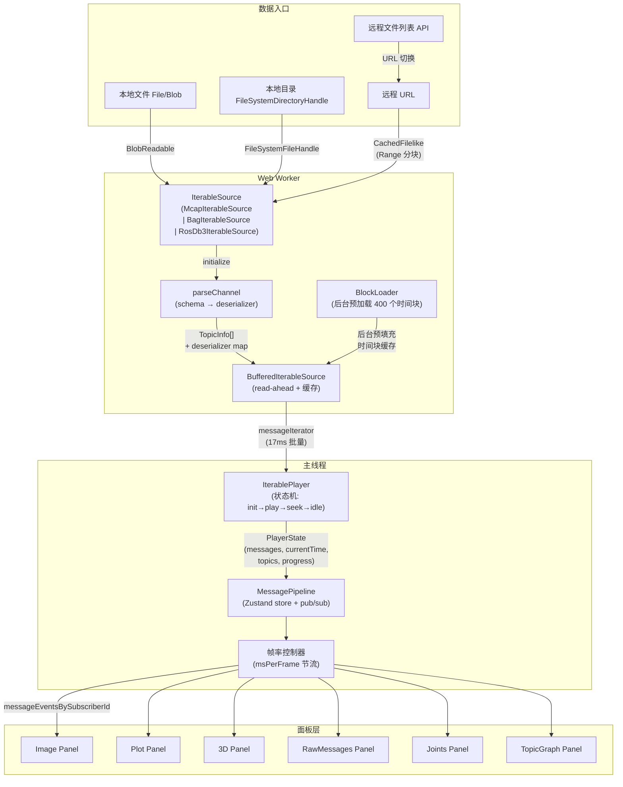
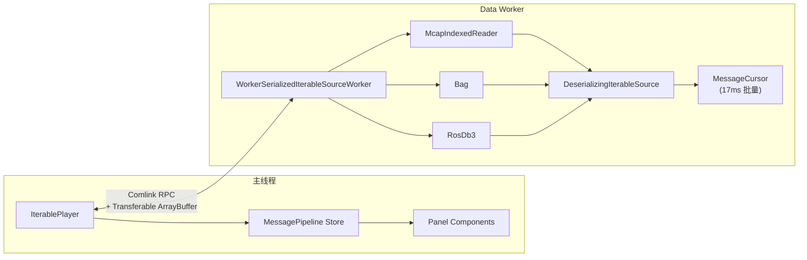
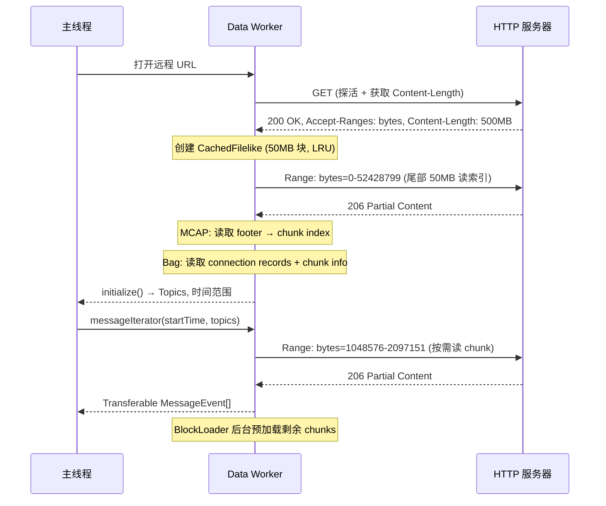

# ROSView 需求与架构设计文档

> 本文档为中文版，英文主版请参阅 [ARCHITECTURE.md](ARCHITECTURE.md)。

> 本文档参考 [Foxglove Studio](https://github.com/foxglove/studio) 等开源 ROS 可视化工具与社区实践，整理需求、架构与技术要点，用于指导 ROSView 的持续演进。

---

## 1. 项目定位与目标

### 1.1 定位

浏览器端 ROS 录制数据可视化应用，支持 **MCAP**、**ROS1 .bag**、**ROS2 .db3**、**HDF5（.h5/.hdf5）** 与 **BVH（.bvh）** 等格式的离线回放与多面板可视化分析。

### 1.2 双形态交付

| 形态 | 说明 |
|------|------|
| **独立产品** | 构建为纯静态网站（SPA），可部署在官网或 CDN，用户无需安装即可使用 |
| **嵌入式组件** | 作为 `@ioai/rosview` npm 包引入 `app/` 主应用，以 React 组件方式加载 |

### 1.3 性能目标

- 打开 1GB MCAP 文件的首帧展示时间 < 2 秒（本地文件）
- 远程文件通过 HTTP Range 分片加载，首帧展示不需等待完整下载
- 播放回放时主线程帧率稳定 60fps，不因数据解析阻塞 UI
- 内存占用可控：通过 LRU 缓存 + 流式读取避免将整个文件加载到内存

---

## 2. 核心功能需求

### 2.1 数据源

| 类型 | 入口 | 实现方式 |
|------|------|----------|
| **本地单文件** | 拖拽到窗口 / 点击「打开文件」按钮 | `File` API → `BlobReadable` |
| **本地目录** | 点击「打开目录」/ 拖拽目录 | `FileSystemDirectoryHandle` → 扫描 `.mcap/.bag/.db3/.h5/.hdf5/.bvh` 文件列表 |
| **远程单文件** | URL 输入框 / 查询参数 `?url=` | `fetch` + `Range` 请求 → `CachedFilelike` 分块缓存 |
| **远程文件列表** | 宿主传入 `fileManifest` prop | 加载 JSON manifest，在 Datasets Tab 展示与切换 |

### 2.2 文件格式与消息编码

**支持的文件格式：**

| 格式 | 解析库 | Range 支持 | 说明 |
|------|--------|------------|------|
| **MCAP** | `@mcap/core` + `@foxglove/mcap-support` | 完整支持（索引读取） | 首选格式，有 chunk 索引可做高效区间查询 |
| **ROS1 .bag** | `@foxglove/rosbag` | 完整支持（chunk 索引） | 通过 `CachedFilelike` + `BrowserHttpReader` 实现 |
| **ROS2 .db3** | `@foxglove/rosbag2` + `sql.js` (WASM) | 本地支持 / 远程需整文件下载 | SQLite 格式限制，远程大文件建议转 MCAP |
| **HDF5** | `@ioai/hdf5` (WASM) | 部分读取 | 科学数据；浏览器内解析 |
| **BVH** | 内置解析 | 不适用（非 ROS bag 类流） | 骨骼动作捕捉动画回放 |

**支持的消息编码（与 Foxglove 一致）：**

| 编码格式 | Schema 类型 | 解析方式 |
|----------|-------------|----------|
| `ros1` | `ros1msg` | `@foxglove/rosmsg-serialization` → `MessageReader` |
| `cdr` (ROS2) | `ros2msg` / `ros2idl` / `omgidl` | `@foxglove/rosmsg2-serialization` → `ROS2MessageReader` 或 `OmgidlMessageReader` |
| `protobuf` | `protobuf` | `protobufjs` → `Root.decode` |
| `flatbuffer` | `flatbuffer` | FlatBuffers schema 解析 |
| `json` | `jsonschema` 或无 | `TextDecoder` + `JSON.parse` |

### 2.3 面板系统（首批 6 种）

| 面板类型 | 说明 | 订阅的典型 Topic 类型 |
|----------|------|----------------------|
| **Image** | 显示相机图像流（JPEG/PNG/H264 解码） | `sensor_msgs/Image`, `sensor_msgs/CompressedImage` |
| **Plot** | 数值曲线图，支持多 Topic 叠加 | 任意含数值字段的消息（如 `std_msgs/Float64`） |
| **3D** | 点云、URDF 模型、TF 坐标变换可视化 | `sensor_msgs/PointCloud2`, `tf2_msgs/TFMessage`, URDF |
| **RawMessages** | 原始消息 JSON 树形查看器 | 任意 Topic |
| **Joints** | 机器人关节状态可视化（角度/力矩仪表盘） | `sensor_msgs/JointState` |
| **TopicGraph** | Topic 与节点的拓扑关系图 | 元数据（Topic 列表 + Publisher/Subscriber 关系） |

面板系统要求：
- 每种面板类型通过 `React.lazy` 懒加载，不使用的面板代码不进入首包
- 面板通过 `panelId` 向 MessagePipeline 声明订阅，只接收自己关心的 Topic 数据
- 面板设置面板（Settings Sidebar）支持每个面板独立配置（如选择 Topic、颜色映射等）
- 预留面板注册接口，未来可通过 `registerPanel` API 扩展第三方面板

### 2.4 播放系统

| 能力 | 说明 |
|------|------|
| **播放/暂停** | 按文件中的时间戳顺序推送消息 |
| **变速播放** | 0.1x / 0.25x / 0.5x / 1x / 2x / 4x / 8x / 最大速度 |
| **精确 Seek** | 点击时间轴任意位置跳转，需 backfill 目标时间点附近的最新消息 |
| **循环播放** | 到达末尾自动回到起点重播 |
| **逐帧步进** | 前进/后退一条消息或一个固定时间步长 |
| **进度指示** | 显示已加载的时间范围（远程文件部分加载时的进度条） |

### 2.5 侧边栏

侧边栏位于内容区左侧，固定宽度（可由用户隐藏），包含三个 Tab：

#### Topics Tab
- 树形展示当前文件中的所有 ROS Topic
- 每个 Topic 显示：名称、消息类型、消息频率、消息计数
- 点击 Topic 可快速添加对应类型的面板到 DockView
- 支持搜索过滤

#### Datasets Tab
- **本地目录模式**：显示已打开目录下所有支持的录制文件（.mcap/.bag/.db3/.h5/.hdf5/.bvh），点击切换
- **远程列表模式**：通过 `fileManifest` prop 传入 manifest URL，加载后展示列表供切换
- 当前播放的文件高亮显示
- 显示每个文件的基本元信息（大小、时长、Topic 数量）

#### Annotations Tab（标注功能）
- **时间轴标记**：在时间轴上标记关键时刻（如「机器人摔倒」「抓取成功」），支持自定义标签和颜色
- **图像标注**：在 Image 面板上绘制边界框/多边形/关键点，关联到特定时间帧
- **质量标签**：对时间段标记好/坏/待审核，用于训练数据筛选
- 标注数据导出为 JSON 格式

### 2.6 布局系统

- 基于 DockView 实现多面板可拖拽、可停靠布局
- 根据 Topic 数量和类型自动排版（参考 lerobot-studio 的 `getAutoLayoutVisualRows` 逻辑）：
  - Image/Video 类 Topic → 上方视觉区，自动分行
  - 数值类 Topic → 下方 Plot 面板
  - 视觉区与数据区高度比约 2:1
- 支持导出当前布局为 JSON 配置文件
- 支持导入布局配置文件恢复面板排列
- 内置几种预设布局（如「纯图像」「图像+关节」「全功能」等）

### 2.7 国际化

- 支持中文 / 英文 / 日文三种语言
- 使用 `react-intl`（与 lerobot-studio 保持一致）
- URL 参数 `?language=` 或宿主 prop 可强制指定语言
- 语言文件放在 `src/shared/intl/{en,zh,ja}.json`（由 `RosViewProvider` 等加载）

### 2.8 主题

- 支持 Light / Dark / System 三种主题模式
- DockView 主题同步切换：`DockviewReact` 传入 `theme`（`dockview-theme-*` + `ros-dockview-theme-*`），外层 `data-dockview-chrome-theme` 便于测试与宿主诊断
- Tailwind CSS `darkMode: ['class']`，在根容器 `#rosview-root` 上切换 `dark` class
- 嵌入式使用时，宿主可通过 prop 控制主题

---

## 3. 页面结构设计

```
+-----------------------------------------------------------------------+
|  [打开▼]  [打开目录]        demo.mcap (已加载)        [中/En] [🌙/☀️] |  <- 导航栏
+-----------------------------------------------------------------------+
| Topics    |                                                           |
| Datasets  |   +-------------------+-------------------+               |
| Annotate  |   |                   |                   |               |
|           |   |   Image Panel 1   |   Image Panel 2   |               |
| --------- |   |                   |                   |               |
| /camera/  |   +-------------------+-------------------+               |
|   image   |   |                                       |               |
|   1920x   |   |          3D Panel (点云/URDF)          |               |
|   30Hz    |   |                                       |               |  <- DockView 主面板区
| /joint_   |   +-------------------+-------------------+               |
|   states  |   |                   |                   |               |
|   100Hz   |   |   Plot Panel      |  RawMessages      |               |
|           |   |   (关节角度曲线)    |  (原始消息)        |               |
|           |   +-------------------+-------------------+               |
+-----------+-----------------------------------------------------------+
|  [⏮] [▶] [⏭]  ===●========================  0:15 / 2:30  [1x▼] [⟳] |  <- 播放控制条
+-----------------------------------------------------------------------+
```

### 3.1 导航栏（Navbar）

**左侧 - 数据入口：**
- 「打开文件」下拉按钮：包含「打开本地文件」「打开本地目录」「输入远程 URL」三个选项
- 拖拽区域覆盖整个窗口（拖入文件时显示全屏 Drop Zone）

**中间 - 状态显示：**
- 文件名 + 加载状态（加载中/已就绪/错误）
- 加载进度条（远程文件下载时显示）

**右侧 - 全局操作：**
- 语言切换按钮
- 主题切换按钮（Light/Dark/System）
- 布局操作：导入/导出布局配置

### 3.2 侧边栏（Sidebar）

- 固定宽度 280px，可通过按钮完全收起
- 顶部 Tab 切换：Topics / Datasets / Annotations
- 底部可选显示文件元信息摘要

### 3.3 主面板区（DockView）

- 占据侧边栏右侧的全部剩余空间
- DockView 提供拖拽、分割、Tab 堆叠能力
- 每个面板有标题栏，显示面板类型图标 + Topic 名称 + 关闭按钮
- 空状态时显示「拖拽 Topic 到此处或从侧边栏添加面板」

### 3.4 播放控制条（PlaybackBar）

- 固定在底部，高度约 48px
- 左侧：逐帧后退 / 播放暂停 / 逐帧前进
- 中间：可拖拽的时间轴进度条，显示已加载范围（半透明覆盖）
- 右侧：当前时间 / 总时长、倍速选择下拉、循环播放开关

---

## 4. 技术栈

### 4.1 构建工具链

| 工具 | 版本 | 说明 |
|------|------|------|
| Vite | ^8.0 | 构建与开发服务器，已在脚手架中配置 |
| React | ^19.2 | UI 框架 |
| TypeScript | ~6.0 | 类型系统 |
| ESLint | ^9.39 | 代码质量（Flat Config） |

### 4.2 UI 与样式

| 库 | 说明 |
|----|------|
| Tailwind CSS ^3.4 | 原子化 CSS，`important: '#rosview-root'` 避免嵌入时样式泄漏 |
| Radix UI | 无头 UI 组件（Dialog、DropdownMenu、Tabs、Slider、Tooltip 等） |
| class-variance-authority | 组件变体管理（shadcn 风格） |
| tailwind-merge | 合并 Tailwind class |
| clsx | 条件 class 拼接 |
| lucide-react | 图标库 |

### 4.3 布局

| 库 | 说明 |
|----|------|
| dockview ^4.13 | 多面板可拖拽停靠布局 |

### 4.4 数据处理与 ROS 生态

| 库 | 说明 |
|----|------|
| `@mcap/core` | MCAP 文件格式读写核心（索引读取 + 流式读取） |
| `@foxglove/mcap-support` | MCAP 通道解析、Schema 到 JS 对象的桥接、解压处理器 |
| `@foxglove/rosbag` | ROS1 .bag 文件读取（支持 BlobReader + 远程 CachedFilelike） |
| `@foxglove/rosbag2` | ROS2 .db3 文件读取（SQLite 查询 + CDR 解码） |
| `@foxglove/rosmsg` | ROS 消息定义解析 |
| `@foxglove/rosmsg-serialization` | ROS1 消息反序列化 |
| `@foxglove/rosmsg2-serialization` | ROS2 CDR 消息反序列化 |
| `comlink` ^4.4 | Web Worker 双向 RPC（支持 Transferable） |
| `sql.js` | SQLite WASM 运行时（用于 .db3 文件读取） |

### 4.5 可视化

| 库 | 说明 |
|----|------|
| uplot ^1.6 | 高性能时序曲线图（Plot 面板） |
| three.js | 3D 渲染引擎（3D 面板：点云、URDF） |
| `@react-three/fiber` | Three.js 的 React 绑定 |
| `@react-three/drei` | Three.js 常用工具集（OrbitControls 等） |
| 内置 URDF 解析器（`DOMParser`） | URDF 机器人模型加载 |

### 4.6 状态管理

| 库 | 用途 |
|----|------|
| zustand | UI 状态管理（主题、语言、面板配置、侧边栏状态等） |
| 自研 MessagePipeline | 高频数据管线（发布/订阅模式 + 全局帧率限制） |

**选择 Zustand + 自研 MessagePipeline 的理由：**
- Zustand 的 selector 机制天然实现细粒度订阅，面板只在关心的数据变化时更新
- MessagePipeline 是独立于 React 的发布/订阅系统，Player 每帧产出的消息按 Topic/SubscriberId 分桶分发
- 全局帧率限制在 Pipeline 层实现：控制 `msPerFrame`，确保所有面板统一节流
- 播放帧索引使用 `ref + subscriber` 模式（参考 lerobot-studio），播放推进不触发 React 重渲染

### 4.7 国际化

| 库 | 说明 |
|----|------|
| react-intl ^10.1 | 国际化运行时（与 lerobot-studio 保持一致） |

### 4.8 压缩与编解码

| 库 | 说明 |
|----|------|
| fflate | 通用压缩/解压（gzip/deflate/zlib） |
| lz4-wasm 或 lz4js | LZ4 解压（ROS1 .bag chunk 压缩） |
| fzstd | Zstandard 解压（MCAP chunk 压缩） |

---

## 5. 架构设计

### 5.1 整体数据流



### 5.2 核心模块职责

#### DataSource 层

为不同来源提供统一的字节读取抽象：

```typescript
// 面向 ROS 文件的随机读取接口
interface Readable {
  size(): number;
  read(offset: number, length: number): Promise<Uint8Array>;
}

// 本地文件
class BlobReadable implements Readable { ... }

// 远程文件（HTTP Range + LRU 缓存）
class CachedFilelike implements Readable {
  // 50MB 块大小，LRU 缓存
  // 单连接复用，顺序读时自动 read-ahead
  // 与 Foxglove 的 CachedFilelike 设计一致
}
```

#### IterableSource 层（运行在 Worker 中）

每种文件格式实现 `IIterableSource` 接口：

```typescript
interface IIterableSource {
  initialize(): Promise<Initialization>;
  messageIterator(args: MessageIteratorArgs): AsyncIterableIterator<IteratorResult>;
  getBackfillMessages(args: GetBackfillMessagesArgs): Promise<MessageEvent[]>;
}

// Initialization 包含：
interface Initialization {
  topics: TopicInfo[];        // 所有 Topic 及类型
  datatypes: RosDatatypes;    // 消息类型定义树
  start: Time;                // 数据起始时间
  end: Time;                  // 数据结束时间
  publishersByTopic: Map<string, Set<string>>;
  topicStats: Map<string, TopicStats>;
  problems: PlayerProblem[];
}
```

#### Player 层

`IterablePlayer` 是核心状态机，管理播放生命周期：

```
状态转换:
  preinit → initialize → start-play → idle
                                        ↕
                                    seek-backfill
                                        ↕
                                       play
                                        ↕
                                       close
```

关键设计：
- **BufferedIterableSource**：生产者-消费者模式，默认 read-ahead 10 秒数据
- **BlockLoader**：将整个文件时间线划分为最多 400 个 block，后台预加载
- **Seek backfill**：跳转到目标时间时，为每个已订阅 Topic 获取最近一条消息（确保面板立即有数据显示）
- **启动延迟**：初始化后等待 100ms 再开始播放，让面板先完成 `setSubscriptions`

#### MessagePipeline 层

核心消息分发管线（Zustand store + 自定义发布/订阅）：

```typescript
interface MessagePipelineState {
  // Player 状态
  playerState: PlayerState;
  sortedTopics: Topic[];
  datatypes: RosDatatypes;

  // 订阅管理
  subscriptions: Map<string, SubscriptionInfo>;

  // 消息分发（按面板 subscriberId 分桶）
  messageEventsBySubscriberId: Map<string, MessageEvent[]>;
  lastMessageEventByTopic: Map<string, MessageEvent>;

  // 帧率控制
  msPerFrame: number;  // 默认 16.67ms (60fps)

  // 操作
  seekPlayback: (time: Time) => void;
  startPlayback: () => void;
  pausePlayback: () => void;
  setPlaybackSpeed: (speed: number) => void;
  setSubscriptions: (id: string, subscriptions: Subscription[]) => void;
}
```

帧率控制机制：
1. Player 通过 `setListener` 推送 PlayerState
2. Pipeline 收到后，必须等上一帧所有面板 `renderDone` 后才处理下一帧
3. `msPerFrame` 限制两帧之间的最小间隔
4. 面板通过 `useMessagePipeline(selector)` 只订阅需要的切片

#### 面板层

每个面板通过 MessagePipeline 的 selector 订阅数据：

```typescript
function ImagePanel() {
  // 只在该面板订阅的消息更新时重渲染
  const messages = useMessagePipeline(
    (state) => state.messageEventsBySubscriberId.get(panelId)
  );
  // ...
}
```

### 5.3 Worker 架构



**Worker 内完成的工作：**
1. 文件解析（MCAP 索引读取 / Bag chunk 扫描 / db3 SQLite 查询）
2. 消息反序列化（ROS1 msg / CDR / Protobuf / JSON → JS 对象）
3. 批量游标：`nextBatch(17ms)` 一次返回约一帧渲染所需的消息量
4. 通过 `Comlink.transfer` 传回 `ArrayBuffer`，零拷贝跨线程

**Worker 初始化流程：**
1. 主线程根据文件扩展名选择对应 Worker（`McapWorker` / `BagWorker` / `Db3Worker`）
2. Worker 内创建 `IterableSource` 实例 → `DeserializingIterableSource` 包装
3. `initialize()` 返回 Topic 列表、时间范围等元数据
4. 主线程 Player 进入播放状态机

### 5.4 远程文件加载策略



**CachedFilelike 关键参数（参考 Foxglove）：**

| 参数 | 值 | 说明 |
|------|-----|------|
| `CACHE_BLOCK_SIZE` | 50 MB | 单次 Range 请求的块大小 |
| `CLOSE_ENOUGH_THRESHOLD` | 50 MB | 当前下载流距目标 < 此值时不另开连接 |
| `cacheSizeInBytes` | Bag: 200MB / MCAP: Infinity | LRU 缓存上限 |

**CORS 要求：** 远程服务器必须正确配置 `Access-Control-Allow-Origin`、`Access-Control-Expose-Headers: Content-Length, Accept-Ranges, Content-Range`。

---

## 6. 性能关键设计

### 6.1 总结：超越 Foxglove 的性能策略

| 策略 | Foxglove 做法 | ROSView 改进方向 |
|------|--------------|-------------------|
| Worker 架构 | 文件解析在 Worker，反序列化可在主线程 | **全部在 Worker**，主线程只接收已反序列化的 JS 对象 |
| 批量读取 | 17ms 批量 | 保持 17ms 批量，但优化批量内的序列化开销 |
| 跨线程传输 | Comlink.transfer ArrayBuffer | 同样使用 Transferable，减少不必要的 structuredClone |
| 面板渲染 | React 组件 + selector | **帧索引 ref + subscriber 模式**（参考 lerobot-studio），播放推进不触发 React 树重渲染 |
| 缓存策略 | CachedFilelike + LRU | 相同策略，根据文件格式选择不同 cache size |
| 面板代码分割 | React.lazy per panel type | 同样 React.lazy，但面板更轻量（fewer dependencies） |
| 布局库 | react-mosaic（纯分割） | DockView（Tab + 拖拽 + 分割），对复杂布局体验更好 |
| 预加载 | BlockLoader 400 blocks | 相同策略，可动态调整 block 数量 |

### 6.2 帧率控制详细设计

```typescript
// MessagePipeline 帧率控制
class FrameRateController {
  private msPerFrame: number = 16.67; // 60fps
  private lastFrameTime: number = 0;
  private pendingFrame: PlayerState | null = null;
  private renderDoneCallbacks: Set<() => void> = new Set();

  onPlayerStateUpdate(state: PlayerState) {
    this.pendingFrame = state;
    this.scheduleFrame();
  }

  private scheduleFrame() {
    const now = performance.now();
    const elapsed = now - this.lastFrameTime;
    if (elapsed >= this.msPerFrame && this.allPanelsReady()) {
      this.dispatchFrame();
    } else {
      requestAnimationFrame(() => this.scheduleFrame());
    }
  }

  private allPanelsReady(): boolean {
    return this.renderDoneCallbacks.size === 0;
  }
}
```

### 6.3 播放帧索引优化

参考 lerobot-studio 的 `subscribeFrameIndex` 模式：

```typescript
// 播放时间不通过 React state 传递
const currentTimeRef = useRef<Time>();
const subscribersRef = useRef<Set<(time: Time) => void>>(new Set());

function subscribeCurrentTime(callback: (time: Time) => void) {
  subscribersRef.current.add(callback);
  return () => subscribersRef.current.delete(callback);
}

// 播放推进时直接调 subscriber（不触发 React 渲染）
function advanceTime(time: Time) {
  currentTimeRef.current = time;
  for (const cb of subscribersRef.current) {
    cb(time);
  }
}

// 面板内通过 subscriber 直接更新 DOM
function PlaybackProgressSlider() {
  const sliderRef = useRef<HTMLDivElement>(null);

  useEffect(() => {
    return subscribeCurrentTime((time) => {
      // 直接操作 DOM，不经过 React
      if (sliderRef.current) {
        const percent = timeToPercent(time);
        sliderRef.current.style.width = `${percent}%`;
      }
    });
  }, []);
}
```

---

## 7. 双形态构建配置

### 7.1 SPA 构建（独立产品）

`vite.config.ts` — 标准 Vite + React 配置，构建为可部署的静态网站：

```typescript
import { defineConfig } from 'vite';
import react from '@vitejs/plugin-react';
import wasm from 'vite-plugin-wasm';
import path from 'path';

export default defineConfig({
  plugins: [react()],
  resolve: {
    alias: { '@': path.resolve(__dirname, './src') },
  },
  worker: {
    format: 'es',
    plugins: () => [wasm()],
  },
  build: {
    target: 'esnext',
    rolldownOptions: {
      output: {
        codeSplitting: true,
        manualChunks(id) {
          if (id.includes('dockview')) return 'vendor-dockview';
          if (id.includes('three')) return 'vendor-three';
          // ...
        },
      },
    },
  },
});
```

> Worker  bundle（含 `@ioai/hdf5` Emscripten glue 的原生 top-level await）依赖 `build.target: 'esnext'` 与 ES Module Worker，面向 Chrome/Edge 目标时无需 `vite-plugin-top-level-await` polyfill。

### 7.2 库构建（嵌入式组件）

`vite.lib.config.ts` — 构建为可被 `app/` 引入的 ESM 库；**类型声明在同一轮 `vite build` 内**由 `vite-plugin-dts` 生成，`rollupTypes: true` 借助 API Extractor 合并为单一 `dist-lib/rosview.d.ts`（无需额外脚本）。

要点：`build.lib.entry` 使用**绝对路径**；`dts()` 中设置 `compilerOptions.rootDir = <包>/src` 与 `entryRoot: <包>/src`，避免声明镜像落在 `dist-lib/src/...` 或在 monorepo 非包目录 cwd 下出现空的 `insertTypesEntry` / 空 rollup 结果。完整配置以仓库内 `vite.lib.config.ts` 为准。

```typescript
import { defineConfig } from 'vite';
import react from '@vitejs/plugin-react';
import dts from 'vite-plugin-dts';
import wasm from 'vite-plugin-wasm';
import path from 'path';
import { fileURLToPath } from 'node:url';

const packageDir = path.dirname(fileURLToPath(import.meta.url));

export default defineConfig({
  root: packageDir,
  plugins: [
    react(),
    wasm(),
    dts({
      compilerOptions: { rootDir: path.join(packageDir, 'src') },
      include: ['src/**/*.ts', 'src/**/*.tsx'],
      outDir: 'dist-lib',
      entryRoot: path.join(packageDir, 'src'),
      tsconfigPath: './tsconfig.app.json',
      pathsToAliases: false,
      rollupTypes: true,
      insertTypesEntry: true,
      copyDtsFiles: false,
    }),
  ],
  resolve: {
    alias: { '@': path.join(packageDir, 'src') },
  },
  worker: {
    format: 'es',
    plugins: () => [wasm()],
  },
  build: {
    outDir: 'dist-lib',
    lib: {
      entry: path.join(packageDir, 'src/entrypoints/index.ts'),
      formats: ['es'],
      fileName: 'rosview.es',
    },
    rollupOptions: {
      external: ['react', 'react-dom', 'react/jsx-runtime'],
      output: {
        assetFileNames: (assetInfo) => {
          if (assetInfo.name?.endsWith('.css')) return 'rosview.css';
          return assetInfo.name || '[name][extname]';
        },
      },
    },
    cssCodeSplit: false,
  },
});
```

### 7.3 package.json 配置

```json
{
  "name": "@ioai/rosview",
  "version": "1.0.1",
  "type": "module",
  "main": "./dist-lib/rosview.es.js",
  "module": "./dist-lib/rosview.es.js",
  "types": "./dist-lib/rosview.d.ts",
  "exports": {
    ".": {
      "types": "./dist-lib/rosview.d.ts",
      "import": "./dist-lib/rosview.es.js"
    },
    "./style.css": "./dist-lib/rosview.css"
  },
  "files": ["dist-lib"],
  "scripts": {
    "dev": "vite",
    "build": "tsc -b && vite build",
    "build:lib": "tsc -b && vite build --config vite.lib.config.ts",
    "typecheck": "tsc -b --noEmit",
    "lint": "eslint \"src/**/*.{ts,tsx}\" \"tests/**/*.ts\"",
    "test": "vitest run",
    "preview": "npm run build && vite preview"
  },
  "peerDependencies": {
    "react": "^19.0.0",
    "react-dom": "^19.0.0"
  }
}
```

### 7.4 嵌入式使用示例

```tsx
// 在 app/ 主应用中使用（公开 API 以 src/entrypoints/index.ts 为准）
import { RosViewer } from '@ioai/rosview';
import '@ioai/rosview/style.css';

function MyPage() {
  return (
    <RosViewer
      url="https://example.com/recording.mcap"
      theme="dark"
      language="zh"
      onFatalError={(error) => console.error(error)}
    />
  );
}

// 或自行组合 UI，仅接入主题 / 国际化上下文
import { RosViewProvider } from '@ioai/rosview';
import '@ioai/rosview/style.css';

function CustomPage() {
  return (
    <RosViewProvider theme="dark" language="zh">
      <MyCustomNavbar />
      {/* 自建布局与面板 */}
      <MyCustomFooter />
    </RosViewProvider>
  );
}
```

---

## 8. 源码目录结构（当前实现）

> 下列为仓库 **当前** 分层；`tsconfig` 中 `@/*` 映射到 `src/*`。开发与提交流程见仓库根目录 [CONTRIBUTING.md](../CONTRIBUTING.md) 与 [docs/DEVELOPMENT.md](DEVELOPMENT.md)。

```
rosview/
├── index.html                          # SPA：script → /src/entrypoints/main.tsx
├── package.json
├── vite.config.ts                      # 应用构建
├── vite.lib.config.ts                  # 库构建（entry: src/entrypoints/index.ts）
├── tsconfig.json / tsconfig.app.json / tsconfig.node.json
├── eslint.config.js
├── docs/ARCHITECTURE.md                # 本文档（原 DESIGN.md）
├── public/
│   └── favicon.svg
│
└── src/
    ├── index.css                       # 全局样式 + Tailwind + CSS 变量
    ├── vite-env.d.ts
    │
    ├── entrypoints/
    │   ├── main.tsx                    # SPA：createRoot
    │   ├── App.tsx                     # 独立演示壳（查询参数读源）
    │   └── index.ts                    # npm 包导出入口（对外 API）
    │
    ├── app/
    │   └── AppShell.tsx                # Navbar + RosViewContent 等装配（实现文件见 `src/features/viewer/`）
    │
    ├── core/
    │   ├── pipeline/                   # messageBus、store、useMessagePipeline 等
    │   ├── players/                    # IterablePlayer、BufferedIterableSource
    │   ├── preferences/                # Foxglove 布局、本地偏好读写
    │   └── types/                      # ros / player / panels 类型
    │
    ├── features/
    │   ├── layout/                     # Dockview、dockviewController、Tab 菜单
    │   ├── viewer/                     # 对外 `RosViewer`、内部实现与 `RosViewProvider` / Content
    │   ├── workspace/                  # navbar、sidebar、common、playback
    │   └── panels/                     # 各面板目录 + framework + registry + image-core
    │       └── PANEL_CONTRACT.md       # 面板契约
    │
    ├── shared/
    │   ├── ui/                         # 基础 UI（button、dropdown-menu、scroll-area 等）
    │   ├── hooks/                      # useKeyboardShortcuts、useSidebarStore 等
    │   ├── lib/                        # cn() 等
    │   ├── utils/                      # 纯工具（time、datasetSources、…）
    │   └── intl/                       # en.json / zh.json / ja.json
    │
    └── infra/
        ├── workers/                    # mcap/bag/db3/hdf5 worker 与传输层
        ├── sources/                    # IterableSource 与各格式实现
        └── services/                   # HttpFileReader、CachedFilelike、BlobReadable
```

以下能力若在旧版树状图中出现、但上表中未列出，视为 **规划/拆分方向** 或尚未以独立文件落地，以 `git` 与 IDE 为准。

---

## 9. 依赖清单

### 9.1 运行时依赖

```json
{
  "dependencies": {
    "react": "^19.2.0",
    "react-dom": "^19.2.0",

    "@radix-ui/react-dialog": "^1.1.15",
    "@radix-ui/react-dropdown-menu": "^2.1.16",
    "@radix-ui/react-separator": "^1.1.8",
    "@radix-ui/react-slider": "^1.3.6",
    "@radix-ui/react-slot": "^1.2.4",
    "@radix-ui/react-tabs": "^1.1.13",
    "class-variance-authority": "^0.7.1",
    "clsx": "^2.1.1",
    "tailwind-merge": "^3.4.0",
    "lucide-react": "^0.562.0",

    "dockview": "^4.13.1",

    "@mcap/core": "^2.3.2",
    "@foxglove/mcap-support": "workspace:*",
    "@foxglove/rosbag": "^3.1.2",
    "@foxglove/rosbag2": "^6.0.0",
    "sql.js": "^1.14.1",

    "comlink": "^4.4.2",

    "uplot": "^1.6.32",
    "three": "^0.171.0",
    "@react-three/fiber": "^9.1.0",
    "@react-three/drei": "^10.0.0",

    "react-intl": "^10.1.2",

    "fflate": "^0.8.2",
    "fzstd": "^0.1.1",

    "zustand": "^5.0.0",
    "eventemitter3": "^5.0.1"
  }
}
```

> 注意：`@foxglove/mcap-support` 中的 `parseChannel` 功能可能需要从 Foxglove Studio 源码中抽取为本地包（或直接复制实现），因为该包未独立发布到 npm。如果需要 Protobuf 支持，还需添加 `protobufjs`。

### 9.2 开发依赖

```json
{
  "devDependencies": {
    "@eslint/js": "^9.39.0",
    "@types/node": "^24.12.0",
    "@types/react": "^19.2.14",
    "@types/react-dom": "^19.2.3",
    "@types/three": "^0.171.0",
    "@vitejs/plugin-react": "^6.0.1",
    "autoprefixer": "^10.4.23",
    "eslint": "^9.39.0",
    "eslint-plugin-react-hooks": "^7.0.1",
    "eslint-plugin-react-refresh": "^0.5.2",
    "globals": "^17.4.0",
    "postcss": "^8.5.6",
    "tailwindcss": "^3.4.19",
    "typescript": "~6.0.2",
    "typescript-eslint": "^8.58.0",
    "vite": "^8.0.4",
    "vite-plugin-dts": "^4.5.4",
    "vite-plugin-wasm": "^3.5.0",
    "vitest": "^4.0.0"
  }
}
```

---

## 10. 架构预留

### 10.1 实时连接扩展点

当前架构仅支持离线文件回放，但 `IterablePlayer` 与 `MessagePipeline` 的设计允许未来接入实时数据源：

```typescript
// Player 接口抽象：未来可实现 RosbridgePlayer
interface Player {
  setListener(listener: (state: PlayerState) => Promise<void>): void;
  setSubscriptions(subscriptions: Subscription[]): void;
  requestBackfill(): void;
  // 实时连接专属
  setPublishers?(publishers: Publisher[]): void;
  publish?(request: PublishPayload): void;
}

// DataSourceFactory 模式：根据输入类型创建对应 Player
interface DataSourceFactory {
  id: string;
  type: 'file' | 'connection';
  create(args: DataSourceArgs): Player;
}

// 未来添加 rosbridge 工厂
// class RosbridgeDataSourceFactory implements DataSourceFactory { ... }
```

预留接口：
- `PlayerState.capabilities` 数组标识当前 Player 支持的操作（如 `seek`, `playbackControl`, `publish`）
- `MessagePipeline` 的 `setPublishers` / `publish` 方法只在 capability 包含 `advertise` 时可用

### 10.2 插件/扩展系统预留

面板注册采用目录模式（PanelCatalog），未来可扩展为插件系统：

```typescript
// 面板注册接口
interface PanelInfo {
  type: string;                         // 唯一标识符
  title: string;                        // 显示名称
  module: () => Promise<{ default: PanelComponent }>;  // 懒加载
  config?: PanelConfigSpec;             // 面板配置 schema
  supportedMessageTypes?: string[];     // 支持的消息类型
}

// 内置面板注册
const builtinPanels: PanelInfo[] = [
  { type: 'Image', title: 'Image', module: () => import('./panels/ImagePanel') },
  { type: 'Plot', title: 'Plot', module: () => import('./panels/PlotPanel') },
  // ...
];

// 未来扩展接口
interface ExtensionContext {
  registerPanel(registration: PanelRegistration): void;
  registerMessageConverter(registration: MessageConverterRegistration): void;
  registerTopicAlias(registration: TopicAliasRegistration): void;
}
```

### 10.3 数据源扩展

`DataSource` / `IterableSource` 接口标准化后，未来可支持更多格式：

- HDF5 文件（通过 `@ioai/hdf5` WASM 读取）
- ROS2 实时连接（通过 DDS 或 rosbridge WebSocket）
- 自定义二进制格式

---

## 11. 开发路线图建议

### Phase 1：基础框架（预计 2-3 周）

1. 搭建项目结构、配置 Tailwind/Radix/DockView/i18n
2. 实现 MessagePipeline + Zustand store
3. 实现本地 MCAP 文件打开（主线程，暂不用 Worker）
4. 实现 RawMessages 面板 + Image 面板
5. 实现基础播放系统（播放/暂停/Seek/进度条）
6. 实现双形态构建（SPA + 库）

### Phase 2：完整文件支持 + Worker（预计 2-3 周）

1. 迁移数据解析到 Web Worker（Comlink + Transferable）
2. 添加 ROS1 .bag 支持
3. 添加 ROS2 .db3 支持
4. 实现 CachedFilelike + HTTP Range 远程加载
5. 实现 Plot 面板（uplot）
6. 实现 Joints 面板

### Phase 3：高级功能（预计 3-4 周）

1. 实现 3D 面板（Three.js + 点云 + URDF）
2. 实现 TopicGraph 面板
3. 实现侧边栏三 Tab（Topics / Datasets / Annotations）
4. 实现标注功能（时间标记 + 图像标注 + 质量标签）
5. 实现布局导入/导出/预设
6. 性能优化与 Foxglove 对比基准测试

### Phase 4：打磨与集成（预计 1-2 周）

1. 完成国际化翻译（zh/en/ja）
2. 集成到 `app/` 主应用
3. 错误处理与边界情况
4. 文档与使用说明
